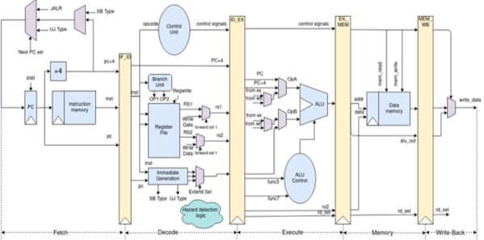
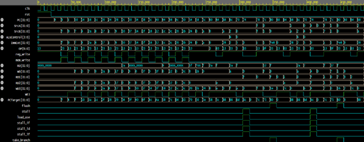
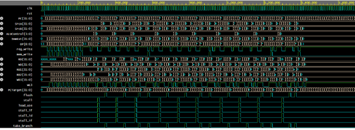
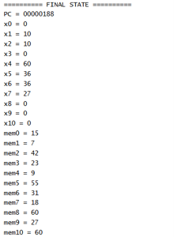

# Pipelined RISC-V Processor Using Verilog

## Overview

This project presents the design and implementation of a 32-bit five-stage Pipelined RISC-V Processor using Verilog HDL. The processor is based on the RV32I instruction set architecture and incorporates pipelining techniques to improve instruction throughput and overall performance.

The design includes hazard handling mechanisms such as a Forwarding Unit and Hazard Detection Unit to ensure correct execution of instructions in a pipelined environment.

## Features

- 32-bit RV32I RISC-V Processor
- Five-stage pipelined architecture
- Hazard Detection Unit
- Forwarding Unit
- Modular Verilog design
- Branch and jump instruction support
- Load and store operations
- Simulation-based verification

## Pipeline Stages

The processor implements the standard five-stage pipeline:

1. **Instruction Fetch (IF)**
2. **Instruction Decode (ID)**
3. **Execute (EX)**
4. **Memory Access (MEM)**
5. **Write Back (WB)**

## Supported Instructions

### R-Type
- ADD
- SUB
- AND
- OR
- XOR
- SLT
- SLL
- SRL
- SRA

### I-Type
- ADDI
- ANDI
- ORI
- XORI
- SLTI
- SLLI
- SRLI
- SRAI
- LW
- JALR

### S-Type
- SW

### B-Type
- BEQ
- BNE
- BLT
- BGE

### U-Type
- LUI

### J-Type
- JAL

**Total Supported Instructions: 26**

## Processor Architecture

### Major Modules

- Program Counter (PC)
- Instruction Memory
- Register File
- Control Unit
- Sign Extension Unit
- Arithmetic Logic Unit (ALU)
- Data Memory
- Pipeline Registers
- Forwarding Unit
- Hazard Detection Unit
- PC+4 Adder
- PC Target Adder
- ALU Source Multiplexer
- Result Multiplexer

### System Architecture

## Hazard Handling

### Forwarding Unit

The Forwarding Unit resolves data hazards by forwarding results directly from later pipeline stages to the Execute stage without waiting for register write-back.

### Hazard Detection Unit

The Hazard Detection Unit detects load-use hazards and control hazards, generating stall and flush signals whenever required.

## Simulation Results

### Register and Memory Contents

## Test Program

The processor was verified using a program that finds the maximum value in an array.

### Result

- Maximum value identified: **60**
- Stored at memory address: **40**
- Memory location index: **10**

## Project Report

The detailed project report is available in the `report` folder.

## Author

**Dharmi Patel**

